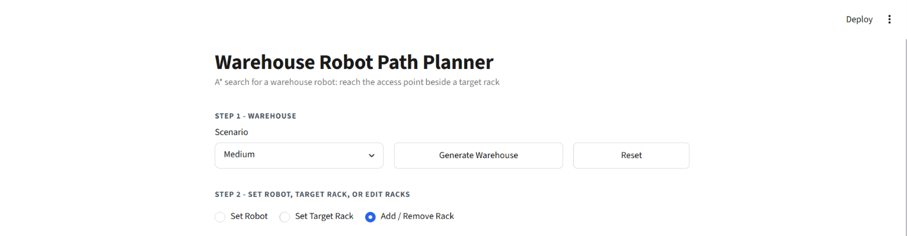
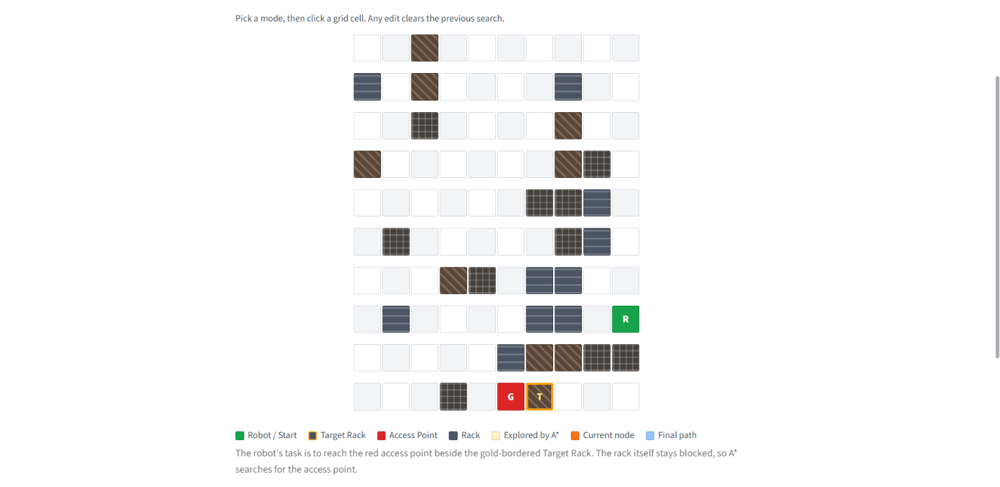
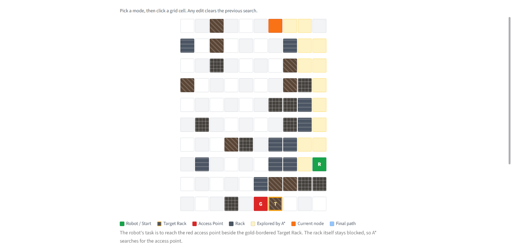
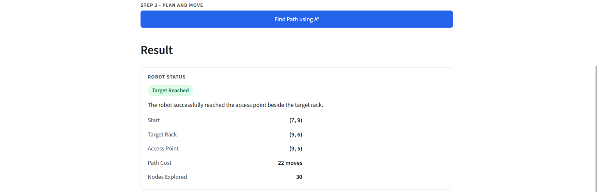

# Warehouse Robot Path Planner

A web-based warehouse robot navigation system developed using **Python, Streamlit, and the A\* Search Algorithm**. The application simulates a warehouse environment where a robot finds the shortest obstacle-free path to the access point of a target storage rack and visually demonstrates the search and robot movement.

---

## Live Demo

**Deployed Application:**  
https://warehouse-robot-path-planner-l2tzapvr6kdh5kedsbjved.streamlit.app/

---

## Features

- A\* Search Algorithm with Manhattan Distance Heuristic
- Shortest Path Finding on a grid-based warehouse
- Interactive warehouse generation
- Easy, Medium, Dense, and Random warehouse scenarios
- Target Rack and Access Point representation
- Visual A\* exploration animation
- Final path visualization
- Step-by-step robot movement animation
- Manual warehouse editing
- Set Robot and Target Rack positions
- Add or Remove warehouse racks
- Path cost and nodes explored statistics
- Target Reached and No Path Found status
- Automatic validation of generated warehouse layouts

---

## How It Works

The warehouse is represented as a **10 × 10 grid** containing open aisle cells and blocked rack cells.

The robot is assigned a Target Rack. Since the robot cannot enter a rack, an open cell directly beside the rack is selected as the **Access Point**.

A\* Search then calculates the shortest path from the robot to this Access Point using:

```text
f(n) = g(n) + h(n)
```

where:

- `g(n)` = actual cost from the robot to the current cell
- `h(n)` = Manhattan distance from the current cell to the Access Point

The application then visualizes the explored cells, displays the final path, and animates the robot moving along the calculated route.

---

## Tech Stack

| Technology | Purpose                 |
| ---------- | ----------------------- |
| Python 3   | Application & Algorithm |
| Streamlit  | Web Interface           |
| A\* Search | Path Finding            |
| Heap Queue | Priority Queue for A\*  |
| CSS        | UI Styling              |

---

## Project Structure

```text
warehouse-robot-path-planner/
├── app.py
├── astar.py
├── style.css
├── .streamlit/
│   └── config.toml
├── requirements.txt
└── README.md
```

---

## Getting Started

### Prerequisites

- Python 3.9+
- pip

### Installation

Clone the repository:

```bash
git clone <repository-url>
cd warehouse-robot-path-planner
```

Install dependencies:

```bash
pip install -r requirements.txt
```

---

## Run the Application

Start the Streamlit application:

```bash
streamlit run app.py
```

The application will be available at:

```text
http://localhost:8501
```

---

## How to Use

1. Select a warehouse scenario.
2. Click **Generate Warehouse**.
3. Set or edit the Robot and Target Rack if required.
4. Click **Find Path using A\***.
5. Watch the A\* exploration process.
6. View the calculated Final Path.
7. Watch the robot move to the Access Point.
8. Check the result and path statistics.

The application displays:

- Robot starting position
- Target Rack
- Access Point
- Explored nodes
- Path Cost
- Final result

---

## Warehouse Scenarios

| Scenario | Rack Sections | Section Length |
| -------- | ------------- | -------------- |
| Easy     | 2–4           | 3–4            |
| Medium   | 4–6           | 3–5            |
| Dense    | 8–11          | 4–6            |
| Random   | 4–7           | 3–6            |

Generated warehouses are validated to ensure that the robot can reach the selected Access Point.

---

## Screenshots

### Warehouse Interface



### Warehouse Grid



### A\* Exploration



### Result & Statistics



---

## Future Improvements

- Adjustable warehouse grid size
- Weighted cells and different movement costs
- Diagonal movement
- Multiple target racks
- Multiple robots
- Dynamic obstacles
- Pause and step controls for A\* exploration
- Adjustable animation speed

---

## License

This project was developed for educational and learning purposes.
